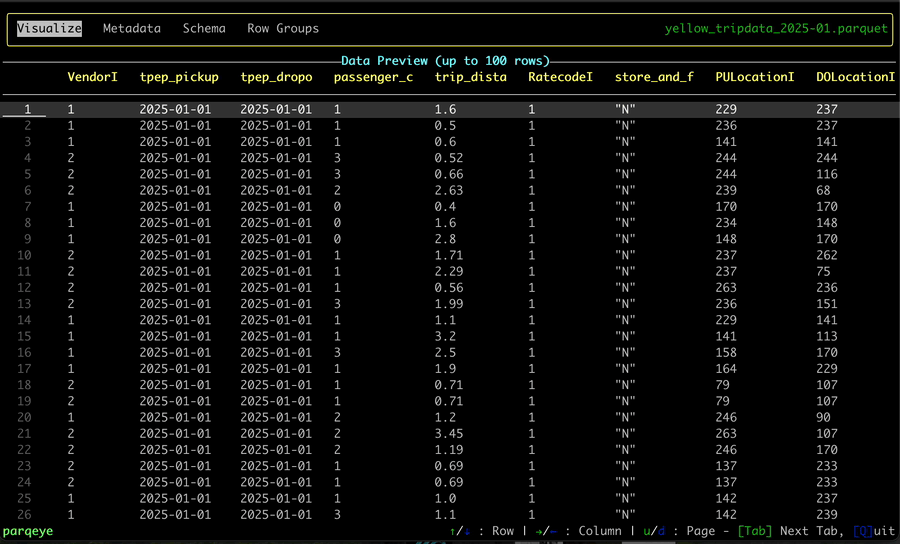

# parqeye

[![CI][actions-badge]][actions-url]

[actions-badge]: https://github.com/kaushiksrini/parqeye/actions/workflows/ci.yaml/badge.svg
[actions-url]: https://github.com/kaushiksrini/parqeye/actions/workflows/ci.yaml

`parqeye` lets you _peek inside_ your Parquet files. Instantly inspect their contents, schema, and metadata — right from your terminal.



# Usage

Run `parqeye` by providing the path to the `.parquet` file.

```
parqeye <path-to-parquet-file>
```

# Installation

## Direct Download

You can download the latest release from the [Releases](https://github.com/kaushiksrini/parqeye/releases) page.

## Build from Source

You can build from source by downloading the repository and running the following command:

```
cargo build --release
```

## Build from Cargo

If you use Rust, build directly from [crates.io](https://crates.io/crates/parqeye)

```
cargo install parqeye
```

# License

This package is released under the [MIT License](./LICENSE).

# Acknowledgements

- [csvlens](https://github.com/YS-L/csvlens) for the inspiration
